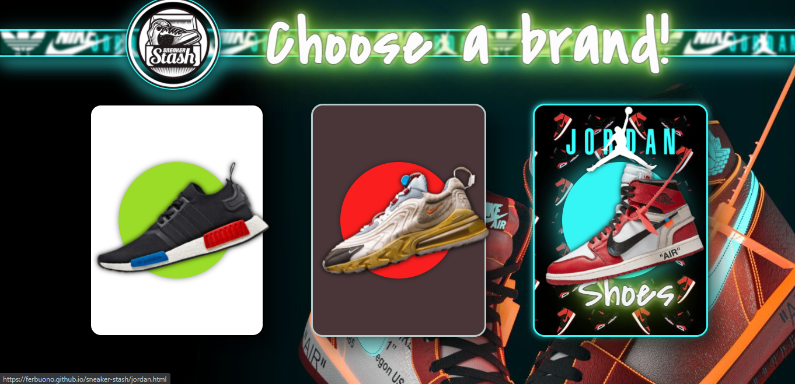

    
    

👟 Shoes ecommerce created with HTML, CSS and JavaScript for the CoderHouse FullStack Web Developer career.

[Live Demo](https://ferbuono.github.io/sneaker-stash/)

## Table of Contents

* [Project overview](#project-overview)

* [Screenshots](#screenshots)

* [Technologies](#technologies)

## Project overview

The main objective of this project was to learn how to handle objects and arrays in the most optimal way.

Each brand page was created with HTML, styled with SASS, and JavaScript code was implemented to make them fully functional. A bit of jQuery was used also.

	
## Screenshots

## Technologies

This project was created with:
* HTML
* SASS
* JavaScript
* jQuery
